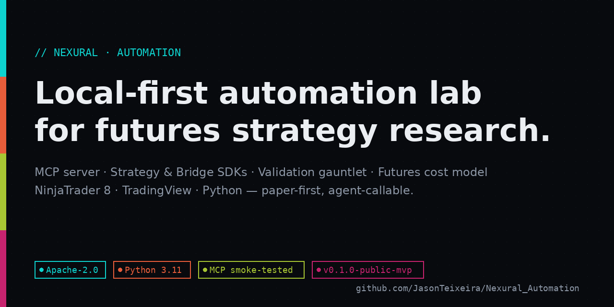
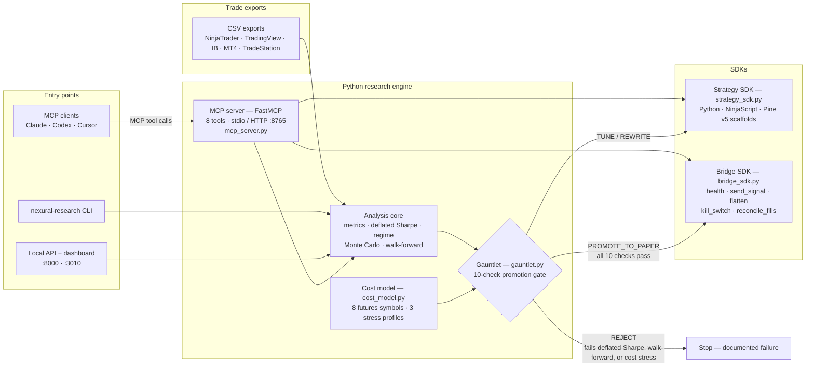

<div align="center">

# Nexural Automation

### A local-first automation lab for futures strategy research

**Take any strategy export from backtest to a paper-trading decision through an institutional-grade gauntlet — overfitting checks, cost stress, and promotion gates — before a dollar is ever at risk.**



[](https://github.com/JasonTeixeira/Nexural_Automation/actions/workflows/ci.yml)
[](https://github.com/JasonTeixeira/Nexural_Automation/actions/workflows/python-research-ci.yml)
[](https://github.com/JasonTeixeira/Nexural_Automation/actions/workflows/docs-and-metadata.yml)
[](https://github.com/JasonTeixeira/Nexural_Automation/actions/workflows/module-catalog.yml)
[](https://github.com/JasonTeixeira/Nexural_Automation/actions/workflows/docs-pages.yml)
[](LICENSE)
[](docs/mcp-contract.md)

[Why](#why-this-exists) · [Architecture](#architecture) · [What it does](#what-it-does) · [Quickstart](#quickstart) · [MCP server](#mcp-automation-server) · [Proof & evidence](#proof--evidence) · [Docs](#public-docs)

</div>

> Not financial advice. This project is for research, education, simulation, and paper-first development. See [DISCLAIMER.md](DISCLAIMER.md).

---

## Why this exists

Most retail strategy development jumps straight from a curve-fit backtest to live money. The steps a trading desk would never skip — deflated-Sharpe overfitting tests, walk-forward validation, Monte Carlo risk envelopes, realistic commission and slippage stress — are exactly the steps hobby tooling leaves out.

Nexural Automation packages that due-diligence pipeline as a **local-first lab**: a Python research engine, an MCP server so AI agents can run the same workflow, a Strategy SDK for scaffolding modules across platforms, and a Bridge SDK that defines the safety lifecycle (health, flatten, kill-switch, fill reconciliation) any execution connector must implement. Everything runs on `127.0.0.1`; nothing trades live.

## Architecture

Verified against the code in `platforms/python/research/nexural-research/src/nexural_research/`.



The gauntlet's four decisions come straight from `gauntlet.py`: **PROMOTE_TO_PAPER** (zero failed checks), **REJECT** (fails deflated Sharpe, walk-forward efficiency, or cost stress), **TUNE** (score ≥ 70), **REWRITE** (everything else).

## What it does

- **Strategy due diligence** — one command runs metrics, deflated Sharpe ratio, regime analysis, parametric Monte Carlo, and rolling walk-forward on any supported CSV export, then issues a graded decision.
- **Futures cost reality check** — per-symbol commission + slippage model (ES, NQ, RTY, CL, GC, SI, HG, ZB) with `normal`, `elevated`, and `crisis` stress profiles applied inside the gauntlet.
- **Strategy SDK** — scaffold documented, schema-validated strategy modules for Python, NinjaTrader (C#), and TradingView (Pine v5), with metadata and no-lookahead policy baked into the templates.
- **Bridge SDK** — a connector protocol whose lifecycle (`health()`, `send_signal()`, `flatten()`, `kill_switch()`, `reconcile_fills()`) is enforced by contract schema and validated in CI; ships a `CsvSignalBridge` reference implementation.
- **Agent-ready via MCP** — the entire workflow is callable by AI agents over stdio or streamable HTTP, with a golden contract fixture guarding backward compatibility.
- **HTML research reports** — local, self-contained report generation for any export.

## Quickstart

### One-command local stack

macOS/Linux:

```bash
git clone https://github.com/JasonTeixeira/Nexural_Automation.git
cd Nexural_Automation
./scripts/start-local-stack.sh
```

Windows:

```powershell
git clone https://github.com/JasonTeixeira/Nexural_Automation.git
cd Nexural_Automation
.\scripts\start-local-stack.ps1
```

This installs the research package (`pip install -e ".[dev,mcp]"`), then starts the API (`http://127.0.0.1:8000`), MCP HTTP server (`http://127.0.0.1:8765/mcp`), and dashboard UI (`http://127.0.0.1:3010`).

### Zero-config smoke test

Runs the full gauntlet on the bundled demo export — no data or keys needed:

```bash
make setup
make smoke     # gauntlet on examples/demo_nq_trades.csv
make report    # HTML research report from the same demo
```

### Run the pipeline on your own export

```bash
cd platforms/python/research/nexural-research
nexural-research gauntlet --input /path/to/nq_strategy.csv --symbol NQ --strategy-name "NQ Research"
nexural-research costs --symbol NQ --trades 250 --stress-profile elevated
nexural-research report --input /path/to/nq_strategy.csv
```

### Scaffold with the SDKs

```bash
nexural-research new-strategy "Opening Range Failure" --platform python
nexural-research validate-strategy ../examples/strategies/opening_range_failure/metadata.yaml

nexural-research new-bridge "NinjaTrader CSV"
nexural-research validate-bridge ../examples/bridges/ninjatrader_csv/bridge_contract.json
```

Requirements: Python 3.11. Node.js 22 only for frontend development; Docker only for the container path (`docker compose up --build` inside `platforms/python/research/nexural-research`).

## MCP Automation Server

Run stdio mode for desktop MCP clients:

```bash
cd platforms/python/research/nexural-research
pip install -e ".[mcp]"
nexural-mcp
```

HTTP mode and smoke test:

```bash
nexural-research mcp --transport streamable-http --host 127.0.0.1 --port 8765
nexural-research mcp-smoke
```

The 8 stable tools:

| Tool | Purpose |
|------|---------|
| `list_capabilities` | Return supported workflows, imports, and guardrails |
| `analyze_strategy_csv` | Full strategy due diligence with metrics, DSR, Monte Carlo, walk-forward, grade, and decision gate |
| `compare_strategy_csvs` | Rank 2–10 strategy exports by composite institutional metrics |
| `generate_report` | Write a local HTML research report for an export |
| `run_strategy_gauntlet` | Run the 10-check promotion gate |
| `estimate_strategy_costs` | Estimate futures commission and slippage |
| `scaffold_strategy` | Create Python, NinjaTrader, or TradingView strategy starters |
| `scaffold_bridge` | Create bridge connector starters with required proof contracts |

Contract details: [MCP Contract](docs/mcp-contract.md) · [MCP/API Examples](docs/mcp-api-examples.md) · [Backward Compatibility](docs/backward-compatibility.md)

## Proof & evidence

Claims in this README are checkable against artifacts in this repo:

| Claim | Artifact |
|-------|----------|
| MCP contract is stable and smoke-tested | Golden fixture: [`platforms/python/research/nexural-research/tests/fixtures/mcp/capabilities.golden.json`](platforms/python/research/nexural-research/tests/fixtures/mcp/capabilities.golden.json) · [docs/mcp-contract.md](docs/mcp-contract.md) |
| Gauntlet runs end to end with zero config | Bundled demo: [`examples/demo_nq_trades.csv`](examples/demo_nq_trades.csv) — exercised by `make smoke` and in CI |
| Measured performance | [BENCHMARKS.md](BENCHMARKS.md) — gauntlet ~1.9 s cold / ~0.4 s warm on 200 trades; MCP cold start ~950 ms |
| Quality gates actually run | Live workflow badges above link to runs: pytest + ruff + mypy + bandit, MCP smoke, schema validation, secret scan, locked dependency audit, Docker build + Trivy, cross-platform (Windows/macOS/Linux) gate |
| Bridge lifecycle is enforced, not aspirational | Contract schema: [`schemas/bridge-contract.schema.json`](schemas/bridge-contract.schema.json) · example: [NinjaTrader CSV Bridge](platforms/python/research/examples/bridges/ninjatrader_csv) |
| Public release state | [v0.1.0-public-mvp](RELEASE_NOTES.md) · live docs: <https://jasonteixeira.github.io/Nexural_Automation/> |

Local release checks you can reproduce:

```bash
python scripts/repo-tools/secret_scan.py
python scripts/repo-tools/validate_contract_schemas.py
cd platforms/python/research/nexural-research
python -m nexural_research.cli quality-gate --threshold 0.95 --json --fast
python -m pytest tests --ignore=tests/e2e -q
```

## Security defaults

- API and MCP HTTP bind to `127.0.0.1` by default; Docker compose binds public services to localhost.
- `.mcp.json`, `.env`, local databases, raw exports, and reports are git-ignored.
- Query-string API keys are not accepted.
- `NEXURAL_ALLOWED_DATA_DIRS` restricts agent-readable CSV/report paths.
- Historical analysis only — no live execution path exists in this repo.

See [Security Hardening](docs/security-hardening.md) and [Secret Rotation](docs/secret-rotation.md).

## Repo layout

```text
Nexural_Automation/
├── platforms/
│   ├── ninjatrader/              # NinjaScript strategies and indicators (C#)
│   ├── tradingview/              # Pine v5 modules
│   └── python/research/
│       ├── examples/             # Public strategy and bridge examples
│       └── nexural-research/     # Python engine, API, MCP server, dashboard
├── templates/                    # Strategy and indicator templates
├── docs/                         # Education, contracts, architecture, launch docs
├── schemas/                      # Strategy and bridge JSON schemas
├── scripts/                      # Setup, local stack, validation, security tooling
└── .github/workflows/            # CI, docs, catalog, and release workflows
```

## Public docs

Start here: [Docs Home](docs/index.md) · [Automation Academy](docs/automation-academy.md) · [Build Your First Strategy](docs/build-your-first-strategy.md) · [Build Your First Bridge](docs/build-your-first-bridge.md) · [Why Strategies Fail The Gauntlet](docs/why-strategies-fail-the-gauntlet.md) · [Automation Glossary](docs/automation-glossary.md) · [Example Catalog](docs/example-catalog.md) · [Install Matrix](docs/install-matrix.md) · [Strategy Lab Wiring](docs/strategy-lab-wiring.md)

Live site: <https://jasonteixeira.github.io/Nexural_Automation/>

## Contributing

1. Read [CONTRIBUTING.md](CONTRIBUTING.md).
2. Use the templates or SDK scaffolds.
3. Document parameters, assumptions, failure modes, and no-lookahead policy.
4. Run validation before opening a PR.
5. Keep examples paper-first and free of performance claims.

Roadmap: [ROADMAP.md](ROADMAP.md) · License: [Apache-2.0](LICENSE)

---

<div align="center">

**Built by Jason Teixeira** — [agency.sageideas.dev](https://agency.sageideas.dev)
Part of a proof-driven portfolio: every claim links to an artifact.

</div>
