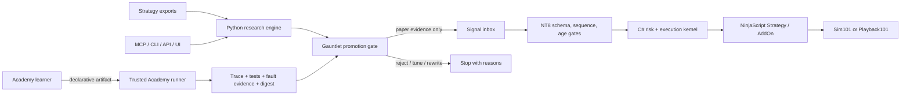

<div align="center">

# Nexural Automation

### The safety-first engineering lab for NinjaTrader 8 automation

Build the strategy. Prove the research. Break the bridge. Recover the state. Promote only the evidence.

[](https://github.com/JasonTeixeira/Nexural_Automation/actions/workflows/ci.yml)
[](https://github.com/JasonTeixeira/Nexural_Automation/actions/workflows/python-research-ci.yml)
[](https://github.com/JasonTeixeira/Nexural_Automation/actions/workflows/nt8-portable-ci.yml)
[](https://github.com/JasonTeixeira/Nexural_Automation/actions/workflows/codeql.yml)
[](https://jasonteixeira.github.io/Nexural_Automation/)
[](LICENSE)
[](platforms/python/research/nexural-research/pyproject.toml)
[](platforms/ninjatrader/docs/SAFETY_SPINE.md)

[Start here](#start-here) · [Academy](#automation-academy) · [NT8 safety spine](#native-nt8-safety-spine) · [Research engine](#research-and-promotion-engine) · [Architecture](#architecture) · [Verification](#verification-contract) · [Docs](#documentation-map)

</div>

> [!CAUTION]
> Research, education, Playback, and simulated execution only. The included bridge has no live-routing mode. This project is not financial advice and passing its tests does not make a strategy safe or profitable. Read the [full disclaimer](DISCLAIMER.md).

## What this repository is

Nexural Automation is an executable learning and validation system for NT8 automation engineering. It joins four surfaces that usually live in disconnected projects:

| Surface | What it gives you | Promotion boundary |
|---|---|---|
| **Learn** | 5 tracks, 60 executable labs, bilingual concepts, seeded faults, 5 capstones | Grading is derived from replayed artifacts, never learner-supplied pass flags |
| **Build** | NinjaScript Strategy/AddOn adapters, strategy scaffolds, bridge contracts, Python SDKs | Live-account routing is absent by design |
| **Validate** | Deflated Sharpe, cost stress, walk-forward evidence, Monte Carlo, deterministic fault tests | A historical export alone cannot pass promotion |
| **Operate** | Durable cursor/ACK recovery, reconciliation, risk limits, kill switch, audit journal | Only `Sim101 + Simulator` or `Playback101 + Playback` can pass the native gate |

The goal is not to collect another folder of standalone strategies. The goal is to teach and enforce the engineering discipline needed to make automation observable, reproducible, recoverable, and difficult to misuse.

## Verified capability status

This table separates automated evidence from claims that still require a human or external environment.

| Capability | Current evidence | Status |
|---|---|---|
| Portable C# execution/risk kernel | 13 deterministic fault scenarios on .NET 8 | **Automated** |
| Native NT8 adapter compile | Exact Strategy/AddOn sources compiled against local NT8 `8.1.7.2`: 0 warnings, 0 errors | **Locally verified** |
| NT8 desktop import and simulated fills | Checklist and evidence contract exist; NinjaTrader exposes no supported headless import command | **Manual gate** |
| Academy catalog | 5 tracks, 60 lesson manifests, 5 capstone manifests; source/package parity tested | **Automated** |
| Academy grading | Trusted data-only runner derives source hash, trace, tests, fault evidence, and digest | **Automated** |
| Python research engine | Cross-platform quality gate, pytest, schema validation, security scans, browser checks | **Automated in CI** |
| Release artifacts | Wheel/sdist, NT8 archive, SBOM, SHA-256 manifest, keyless Sigstore signing workflow | **Configured; verified on release** |
| External beta | Pseudonymous evidence schema and promotion thresholds are implemented | **Prepared, not yet completed** |

## Start here

Requirements: Git, Python 3.11, and PowerShell 7 for the NT8 harness. Node.js 22 is needed only for frontend work. NinjaTrader 8 is needed only for the native compile and desktop verification steps.

### Windows

```powershell
git clone https://github.com/JasonTeixeira/Nexural_Automation.git
cd Nexural_Automation

$env:SETUPTOOLS_USE_DISTUTILS = "stdlib"
cd platforms/python/research/nexural-research
py -3.11 -m pip install -e ".[dev,mcp]"
py -3.11 -m nexural_research.cli quality-gate --threshold 0.95 --json --fast
```

Run the native safety checks from the repository root:

```powershell
cd ../../../..
./platforms/ninjatrader/scripts/Test-NT8SafetySpine.ps1
```

If NT8 is not installed, run the portable kernel and fault suite only:

```powershell
./platforms/ninjatrader/scripts/Test-NT8SafetySpine.ps1 -SkipNativeCompile
```

### macOS or Linux

```bash
git clone https://github.com/JasonTeixeira/Nexural_Automation.git
cd Nexural_Automation
export SETUPTOOLS_USE_DISTUTILS=stdlib
python3.11 -m pip install -e "platforms/python/research/nexural-research[dev,mcp]"
make smoke
make quality-gate
```

Launch the local API, MCP server, and dashboard with [`scripts/start-local-stack.ps1`](scripts/start-local-stack.ps1) on Windows or [`scripts/start-local-stack.sh`](scripts/start-local-stack.sh) on macOS/Linux.

## Automation Academy

The Academy is an executable curriculum, not a page of code snippets. Every lab includes:

- English and Spanish concept material
- a deliberately incomplete starter program and a reference solution
- visible assertions and withheld learner-facing checks
- a deterministic expected trace and seeded fault scenario
- an acceptance rubric tied directly to generated evidence

The hosted grader executes a constrained, data-only trace language. It does not import arbitrary Python or C# from a learner submission. Submitted booleans are ignored; the server replays the source and derives the result.

### Five tracks, sixty labs

| Track | Engineering focus |
|---|---|
| **NinjaTrader Foundations** | lifecycle, calculation modes, historical transitions, sessions, DST, multi-series, Playback, rollover, cleanup, diagnostics |
| **Strategy Builder** | contracts, state machines, managed orders, partial fills, execution updates, brackets, risk limits, multi-instrument safety, paper deployment |
| **Research Operator** | no-lookahead design, walk-forward validation, cost stress, bootstrap/Monte Carlo, optimization bias, regime segmentation, data contracts, evidence bundles |
| **Bridge Engineer** | sequence IDs, ACKs, durable outbox, duplicate delivery, stale signals, disconnect recovery, restart replay, account isolation, reconciliation, kill switch |
| **Agent Automation Engineer** | least privilege, tool allowlists, approval gates, prompt injection, secrets, sandboxes, deterministic plans, timeouts, provenance, audit trails |

```powershell
nexural-research academy catalog --json
nexural-research academy start research.lookahead --learner local-operator --json
nexural-research academy check research.lookahead `
  --learner local-operator `
  --submission ../../../../academy/fixtures/lookahead-safe-submission.json `
  --json
nexural-research academy progress --learner local-operator --json
```

Curriculum authors can create and validate packages without enabling arbitrary code execution:

```powershell
python -m nexural_research.academy.authoring new nt8.example `
  --root academy/lessons `
  --track nt8-foundations `
  --title "Example" `
  --title-es "Ejemplo"
python -m nexural_research.academy.authoring validate academy/lessons/nt8-example
```

Read the [Academy contract](academy/README.md) and [learning-item schema](academy/schema/learning-item.schema.json).

## Native NT8 safety spine

The C# core is platform-portable; the adapters compile against the proprietary NT8 assemblies only in the native harness.

```text
signal file
   │
   ▼
schema + monotonic sequence + age gate
   │
   ▼
exact account/provider gate ── reject anything except Sim101/Playback101
   │
   ▼
reconciliation + risk engine + persistent kill switch
   │
   ▼
order/execution state machine ── journal ── ACK ── durable cursor
```

The fault suite covers duplicate and non-monotonic signals, stale/future signals, unreconciled startup, every risk limit, partial fills, overfills, illegal transitions, restart persistence, cursor/ACK crash gaps, live-account rejection, and flatten-only kill-switch behavior.

Build a validated NT8 import archive:

```powershell
./platforms/ninjatrader/scripts/Build-NinjaTraderArchive.ps1
```

Then follow the explicit [desktop import and Playback verification procedure](platforms/ninjatrader/docs/IMPORT_AND_VERIFY.md). Native compilation proves API compatibility; it does not prove GUI import, provider behavior, or simulated fill timing.

## Research and promotion engine

The Python engine imports strategy exports from NinjaTrader, TradingView, Interactive Brokers, MT4, and TradeStation. It provides:

- 71+ analysis metrics, deflated Sharpe, regime analysis, and Monte Carlo envelopes
- rolling walk-forward evaluation with fitted/frozen evidence requirements
- commission and slippage stress for ES, NQ, RTY, CL, GC, SI, HG, and ZB
- a ten-check gauntlet that can promote only to paper, tune, rewrite, or reject
- self-contained HTML reports, CLI/API access, and eight stable MCP tools

```powershell
nexural-research gauntlet --input path/to/trades.csv --symbol NQ --strategy-name "NQ Research"
nexural-research costs --symbol NQ --trades 250 --stress-profile elevated
nexural-research report --input path/to/trades.csv
nexural-research mcp-smoke
```

See the [MCP contract](docs/mcp-contract.md), [API examples](docs/mcp-api-examples.md), and [gauntlet failure guide](docs/why-strategies-fail-the-gauntlet.md).

## Architecture



Trust-boundary decisions are recorded in [ADR 0001](docs/adr/0001-simulation-first-trust-boundaries.md) and the [threat model](docs/threat-model.md).

## Verification contract

Run the same gates locally that protect the release path:

```powershell
# Repository metadata, schemas, secrets, Academy parity
py -3.11 scripts/repo-tools/secret_scan.py
py -3.11 scripts/repo-tools/validate_contract_schemas.py
py -3.11 scripts/repo-tools/validate_beta_evidence.py

# Python engine and Academy
cd platforms/python/research/nexural-research
py -3.11 -m pytest tests --ignore=tests/e2e -q
py -3.11 -m nexural_research.cli quality-gate --threshold 0.95 --json --fast

# Native/portable NT8 checks
cd ../../../..
./platforms/ninjatrader/scripts/Test-NT8SafetySpine.ps1
```

Releases are built from immutable tags. The release gate builds and tests Python distributions, runs browser/auth/accessibility checks, runs the portable NT8 fault suite, validates the NT8 archive, generates an SPDX SBOM and SHA-256 manifest, signs artifacts through keyless Sigstore, and only then dispatches trusted PyPI and GHCR publication workflows. All third-party GitHub Actions are pinned to immutable commit SHAs.

## Repository map

```text
Nexural_Automation/
├── academy/                          # 60 labs, 5 tracks, 5 capstones, schemas, tools
├── platforms/ninjatrader/
│   ├── src/Nexural.NT8.Core/        # portable risk/execution kernel
│   ├── adapters/NinjaScript/         # Strategy and AddOn adapters
│   ├── tests/                        # fault suite and native compile harness
│   ├── scripts/                      # verify and package commands
│   └── docs/                         # safety model, fault matrix, import proof
├── platforms/python/research/
│   └── nexural-research/             # analysis engine, API, MCP, Academy service, UI
├── beta/                             # external evidence contract; no fabricated results
├── schemas/                          # strategy, bridge, beta, and evidence schemas
├── docs/                             # architecture, tutorials, security, operations
├── conductor/                        # product, stack, workflow, and track context
└── .github/workflows/                # CI, native evidence, release, signing, publication
```

## Documentation map

| Goal | Start here |
|---|---|
| Learn the curriculum | [Automation Academy](academy/README.md) |
| Understand native safety | [Safety spine](platforms/ninjatrader/docs/SAFETY_SPINE.md) · [fault matrix](platforms/ninjatrader/docs/FAULT_MATRIX.md) |
| Import into NT8 | [Build, import, and verify](platforms/ninjatrader/docs/IMPORT_AND_VERIFY.md) |
| Build a strategy | [First strategy](docs/build-your-first-strategy.md) · [strategy framework](docs/strategy-framework.md) |
| Build a bridge | [First bridge](docs/build-your-first-bridge.md) · [bridge examples](platforms/python/research/examples/bridges) |
| Validate research | [Gauntlet](docs/why-strategies-fail-the-gauntlet.md) · [benchmarks](BENCHMARKS.md) |
| Operate securely | [Security hardening](docs/security-hardening.md) · [threat model](docs/threat-model.md) |
| Contribute | [Contributing guide](CONTRIBUTING.md) · [roadmap](ROADMAP.md) |

Live documentation: <https://jasonteixeira.github.io/Nexural_Automation/>

## Contributing and responsible disclosure

Contributions must preserve paper-only execution, no-lookahead assumptions, deterministic evidence, and fail-closed behavior. Read [CONTRIBUTING.md](CONTRIBUTING.md) before opening a pull request.

Report vulnerabilities privately through [GitHub Security Advisories](https://github.com/JasonTeixeira/Nexural_Automation/security/advisories/new). Do not include active credentials, personal trading data, or brokerage identifiers in issues or beta artifacts.

External beta submissions must follow [`beta/README.md`](beta/README.md). The repository includes the validation machinery; it does not invent learners, capstones, or successful broker-environment results.

---

<div align="center">

Built by **Jason Teixeira** for the [Nexural](https://www.nexural.io) ecosystem.

**Evidence before promotion. Safety before performance. Simulation before capital.**

</div>
