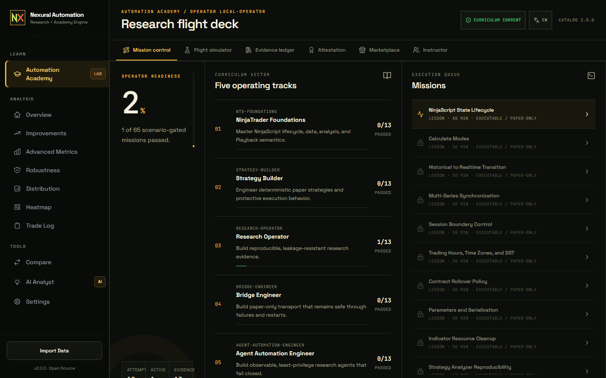
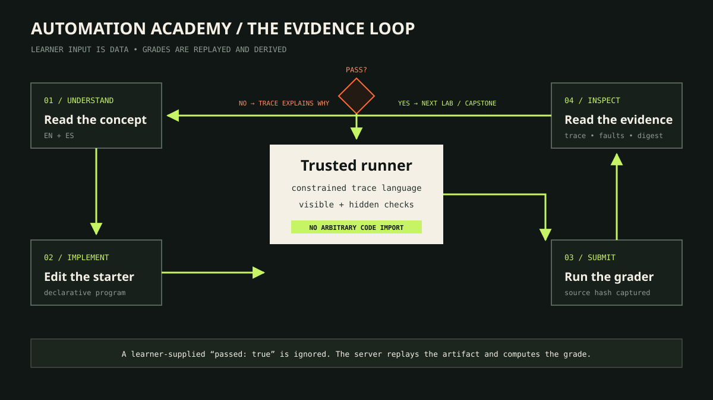

# Automation Academy



[Open the mobile progressive mission index](assets/screenshots/academy-mobile.png)

The Academy is an executable learning system, not a gallery of strategy snippets. Exactly 60 labs
lead to five capstones. Each mission is a versioned content package evaluated by the trusted
`nexural_research.academy` runner.

!!! note "What completion proves"
    An Academy result proves that the learner satisfied a curriculum contract against a specific
    artifact. It does not certify arbitrary learner code, profitability, live-account safety, or
    repository qualification.

## The five-track route

| Track | Learner outcome | Safety boundary |
|---|---|---|
| NinjaTrader Foundations | Understand lifecycle, calculate modes, series, sessions, resources, and Playback behavior | Platform knowledge is not desktop-import evidence |
| Strategy Builder | Produce deterministic, paper-only strategy behavior | No standalone strategy bypasses promotion or native gates |
| Research Operator | Detect leakage, model costs, run walk-forward checks, and preserve evidence | Historical metrics cannot approve execution |
| Bridge Engineer | Build recoverable transport, ACK, cursor, journal, and reconciliation behavior | Only supported simulation account/provider pairs are eligible |
| Agent Automation Engineer | Build observable, least-privilege research agents | Hosted services do not execute arbitrary learner or plugin code |

Each track contains 12 labs and one capstone. Prerequisites are enforced by the domain service;
successful submissions create immutable snapshots in a hash-chained experiment ledger.



## Start the local workspace

Install the Python 3.11 package from the repository root:

```powershell
$env:SETUPTOOLS_USE_DISTUTILS = "stdlib"
py -3.11 -m pip install -e "platforms/python/research/nexural-research[dev,mcp]"
```

Launch the local stack with the repository script:

```powershell
./scripts/start-local-stack.ps1
```

Open the URL printed by the script, select **Automation Academy**, and use Mission control. At
375 pixels the interface presents one expanded track at a time with All, Ready, Active, Passed,
and Locked filters. At larger widths the complete 65-mission queue remains visible.

## Complete one mission from the CLI

The CLI exposes the same catalog and deterministic grader:

```powershell
nexural-research academy catalog --json
nexural-research academy start research.lookahead --learner local-operator --json
nexural-research academy check research.lookahead `
  --learner local-operator `
  --submission academy/fixtures/lookahead-safe-submission.json `
  --json
nexural-research academy progress --learner local-operator --json
```

For every mission:

1. Read `concept.en.md` or `concept.es.md`.
2. Inspect the starter `program.yaml` and public checks.
3. Repair the declarative program; do not add executable Python or C#.
4. Run `academy check`.
5. Use the derived trace and failed assertions to make the next change.
6. Preserve the source hash, trace, test result, fault evidence, and grading digest.

Learner-supplied pass flags are ignored. Only the trusted runner's replayed result can advance a
prerequisite, complete a capstone, or create an attestation.

## Read the evidence, not the score alone

A passing response should contain machine-derived evidence tied to the submitted source:

| Evidence | Why it exists |
|---|---|
| Source hash | Binds the result to the exact declarative program |
| Deterministic trace | Makes the evaluated behavior replayable |
| Public and derived checks | Explains the accepted or rejected behavior |
| Seeded fault result | Proves the mission's failure path was exercised |
| Artifact digest | Detects evidence mutation after grading |
| Ledger link | Preserves the attempt in tamper-evident learner history |

Use **Evidence ledger** in the workspace or:

```powershell
nexural-research academy trace --learner local-operator
```

## Author a compatible learning package

The authoring tools create data-only packages and validate their contract without executing
learner code:

```powershell
py -3.11 -m nexural_research.academy.authoring new nt8.example `
  --root academy/lessons `
  --track nt8-foundations `
  --title "Example" `
  --title-es "Ejemplo"

py -3.11 -m nexural_research.academy.authoring validate academy/lessons/nt8-example
```

Every package includes bilingual concepts, an incomplete starter, a reference solution, public
checks, hidden-test metadata, an expected trace, a seeded fault, and an evidence rubric. The
canonical catalog is generated by `academy/tools/generate_curriculum.py`; source and installed
wheel resources must remain byte-for-byte consistent.

## Interfaces and extension boundary

Academy routes are available below `/api/academy/*` and `/api/v1/academy/*`. When
`NEXURAL_AUTH_ENABLED=true`, bearer authentication isolates learner state by API-key subject.
Plugin entry points load none by default and require an exact local distribution allowlist.

Continue with the [operator manual](operator-manual.md#3-complete-an-academy-lab), the
[Academy source contract](https://github.com/JasonTeixeira/Nexural_Automation/blob/main/academy/README.md),
and the
[learning-item schema](https://github.com/JasonTeixeira/Nexural_Automation/blob/main/academy/schema/learning-item.schema.json).
