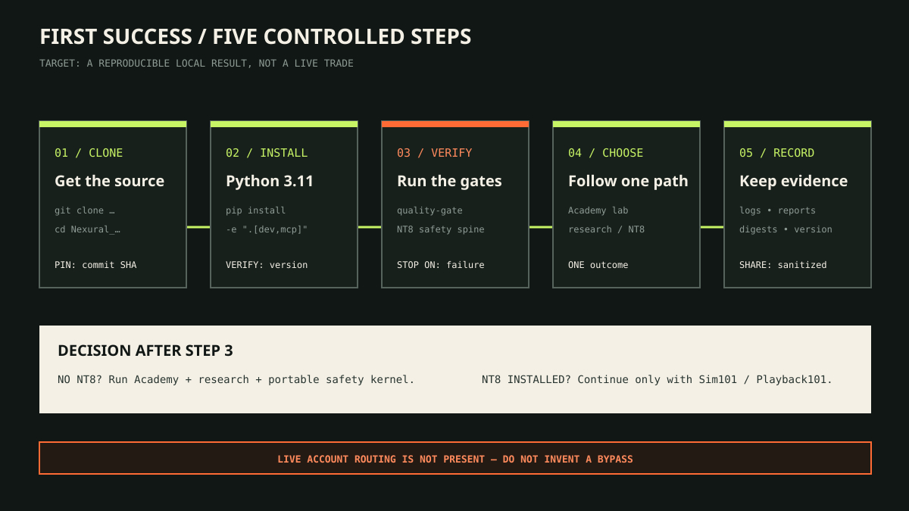

# Installation



Installation is complete only after a verification command passes. The
[visual operator manual](operator-manual.md#2-get-your-first-local-success) shows
the supported paths and the evidence to retain.

## Prerequisites
- Git
- NinjaTrader 8 (for NinjaScript examples)
- TradingView account (for Pine examples)
- Python 3.11 (for research tooling)

## Clone
```bash
git clone https://github.com/JasonTeixeira/Nexural_Automation.git
cd Nexural_Automation
```

## Using templates
- Copy `templates/strategy-template` into the appropriate `platforms/<platform>/...` path.
- Rename the folder to your module name (PascalCase).
- Fill in `metadata.yaml`, `README.md`, and `parameters.md`.

## NinjaTrader notes
NinjaTrader projects are typically imported/managed within NinjaTrader itself.
This repo focuses on **source organization + documentation standards** first.

## TradingView notes
Pine scripts can be pasted into TradingView’s Pine Editor.
Keep scripts small, documented, and explicit about assumptions.

## Python research tooling

The Python research toolkit lives under:
- `platforms/python/research/nexural-research`

Fast setup (recommended):

```powershell
./scripts/setup.ps1
```
