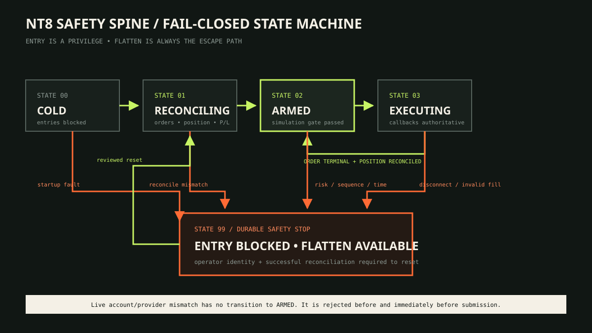
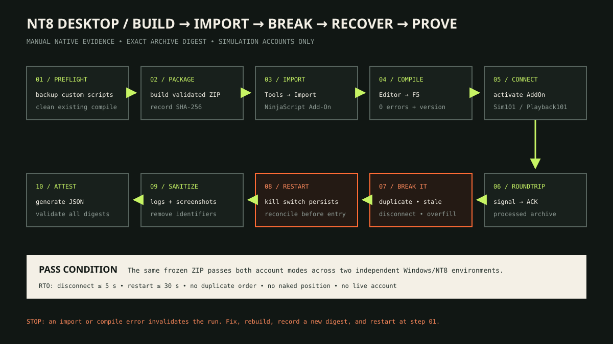
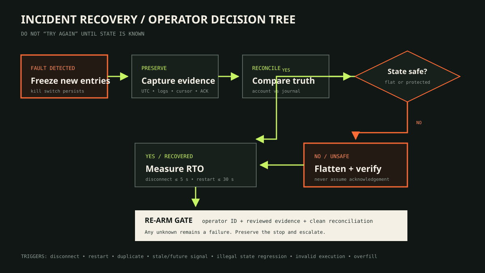

# NinjaTrader 8 safety boundary



!!! danger "Simulation providers only"
    The documented bridge has no live-routing mode. The account name and native
    provider must agree: `Sim101 + Simulator` or `Playback101 + Playback`.
    Everything else fails closed.

## Safety invariants

The portable decision core and native adapter are designed around these invariants:

1. Startup and reconnect remain blocked until connection, orders, position, and
   realized P/L reconcile.
2. Signals are UTC, expiring, gap-free, monotonic, and de-duplicated by signal ID.
3. Order quantity, resulting position, session count, and daily-loss limits are
   evaluated before paper submission.
4. The stop state is durable. Restarting the process does not clear it.
5. Entry remains blocked while a risk-reducing flatten path remains available.
6. Executions are de-duplicated by execution ID; cumulative fills, not requested
   quantity, determine protective sizing.
7. Order and execution callbacks are authoritative. An accepted signal ACK is not a fill.

## Callback lifecycle

```text
signal file
  → exact account + provider gate
  → freshness + sequence gate
  → reconciliation + risk + stop-state gate
  → durable cursor + acknowledgement
  → exact account + provider gate again
  → simulation submit
  → OnOrderUpdate
  → OnExecutionUpdate
  → position reconciliation
```

Playback may produce synchronous executions. Logic must not assume that
`OnBarUpdate` returns before `OnExecutionUpdate`, and it must not rely on one mutable
order object as the only fill record.

## Desktop import verification



From the repository root:

```powershell
./platforms/ninjatrader/scripts/Test-NinjaTraderEnvironment.ps1
./platforms/ninjatrader/scripts/Test-NT8SafetySpine.ps1
./platforms/ninjatrader/scripts/Build-NinjaTraderArchive.ps1
```

Then:

1. Back up custom NinjaScript and compile the existing library cleanly.
2. Record the candidate commit and generated archive SHA-256.
3. Import through **Control Center → Tools → Import → NinjaScript Add-On**.
4. Press ++f5++ in NinjaScript Editor and retain zero-error evidence plus the NT8 version.
5. Activate the AddOn only against an exact supported simulation pair.
6. Test accepted, duplicate, stale, out-of-sequence, disconnect, restart, and stop-state scenarios.
7. Reconcile every order, execution, position, and acknowledgement.
8. Sanitize machine, user, account, and order identifiers.
9. Have an independent operator repeat the frozen artifact procedure.

The current documentation status is
[not independently desktop verified](status.md#qualification-and-evidence-status).
The procedure is a verification contract, not evidence that it was completed.

## Incident response



On connection loss, illegal lifecycle regression, overfill, or unknown state:

1. stop new entries and preserve the durable stop;
2. retain cursor, ACK, order, execution, position, and connection state;
3. reconcile the account against the journal;
4. flatten an unsafe or unknown simulated position and verify through callbacks;
5. require a named operator review before reset;
6. remain blocked when reconciliation is incomplete.

Continue with the [incident security runbook](security-hardening.md) and
[operator manual](operator-manual.md#6-recover-from-an-incident).
