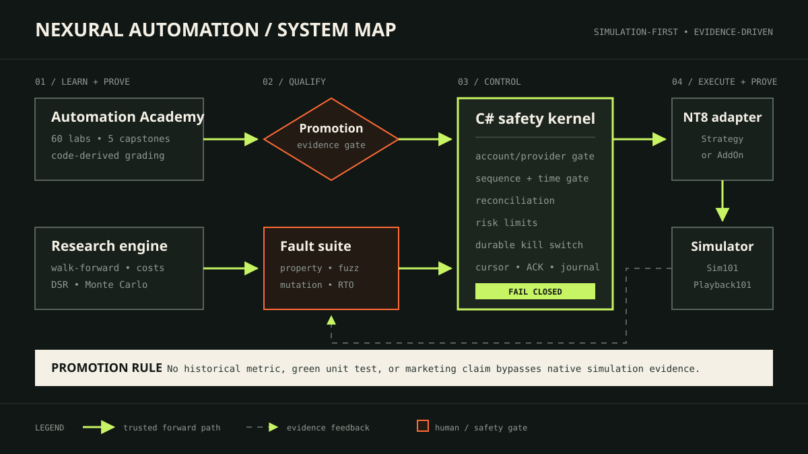
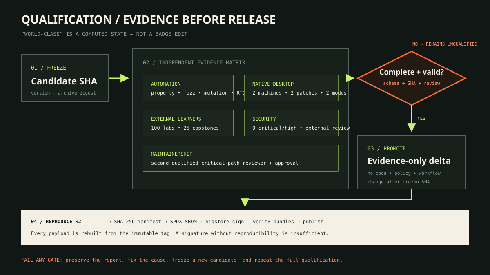
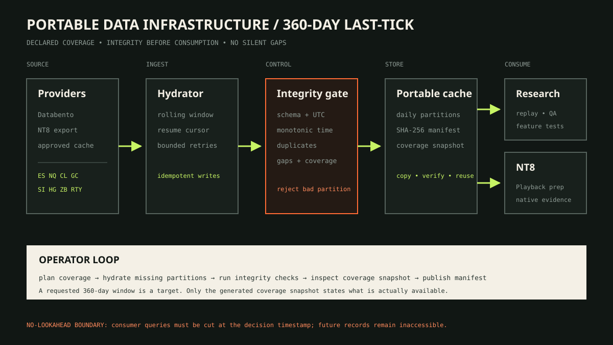

# Visual operator manual

This is the shortest safe route from “I cloned the repository” to a result another
person can reproduce. Use the diagram for orientation, then execute the numbered
runbook beneath it. Never infer a pass from the picture alone.

> [!CAUTION]
> Nexural Automation supports research, education, Playback, and simulated execution.
> It has no live-routing mode. Stop immediately if an account or provider is not the
> exact supported simulation pair.

## Choose your route

| I want to… | Start here | Proof that I finished |
|---|---|---|
| Understand the whole system | [System map](#1-understand-the-system) | You can identify every promotion and trust boundary |
| Get a local result quickly | [First success](#2-get-your-first-local-success) | Quality-gate JSON or a completed Academy artifact |
| Learn automation | [Academy loop](#3-complete-an-academy-lab) | Server-derived trace, tests, source hash, and digest |
| Install and test NT8 | [Desktop runbook](#4-build-import-break-recover-and-prove-in-nt8) | Sanitized schema-valid desktop evidence |
| Respond to an automation fault | [Incident runbook](#6-recover-from-an-incident) | Reconciled state, measured RTO, reviewed reset |
| Prepare a release | [Qualification runbook](#7-qualify-and-release) | Complete computed gate and verified signed artifacts |
| Audit local NT8 history | [Data runbook](#8-operate-the-data-layer) | Coverage snapshot and audit receipt |

## 1. Understand the system



Read the flow left to right:

1. Learn a control in the Academy or produce a research artifact.
2. Pass the relevant promotion and fault gates.
3. Let the portable C# kernel decide whether a signal is eligible.
4. Route only through the native NT8 adapter to `Sim101 + Simulator` or
   `Playback101 + Playback`.
5. Feed evidence back into research and qualification.

The dotted return path is evidence, not an automatic approval. Native simulation
results never establish profitability or readiness for live capital.

## 2. Get your first local success


### Windows

```powershell
git clone https://github.com/JasonTeixeira/Nexural_Automation.git
cd Nexural_Automation

$env:SETUPTOOLS_USE_DISTUTILS = "stdlib"
cd platforms/python/research/nexural-research
py -3.11 -m pip install -e ".[dev,mcp]"
py -3.11 -m nexural_research.cli quality-gate --threshold 0.95 --json --fast
```

Return to the repository root and run the portable safety suite:

```powershell
cd ../../../..
./platforms/ninjatrader/scripts/Test-NT8SafetySpine.ps1 -SkipNativeCompile
```

### macOS or Linux

```bash
git clone https://github.com/JasonTeixeira/Nexural_Automation.git
cd Nexural_Automation
export SETUPTOOLS_USE_DISTUTILS=stdlib
python3.11 -m pip install -e "platforms/python/research/nexural-research[dev,mcp]"
make smoke
make quality-gate
```

Do not continue on a red gate. Save the command, complete output, operating-system
version, Python version, and tested commit SHA before troubleshooting.

## 3. Complete an Academy lab


From the repository root after the editable install:

```powershell
nexural-research academy catalog --json
nexural-research academy start research.lookahead --learner local-operator --json
nexural-research academy check research.lookahead `
  --learner local-operator `
  --submission academy/fixtures/lookahead-safe-submission.json `
  --json
nexural-research academy progress --learner local-operator --json
```

For every lab:

1. Read `concept.en.md` or `concept.es.md`.
2. Inspect the starter `program.yaml` and visible tests.
3. Change the declarative program; do not add executable Python or C#.
4. Run `academy check`.
5. Read the derived trace and failed assertions before editing again.
6. Preserve the resulting source hash and grading digest when the lab passes.

A submitted boolean does not count. Only the trusted runner’s replayed result can
advance prerequisites or capstone completion.

## 4. Build, import, break, recover, and prove in NT8


Build from the repository root:

```powershell
./platforms/ninjatrader/scripts/Test-NinjaTraderEnvironment.ps1
./platforms/ninjatrader/scripts/Test-NT8SafetySpine.ps1
./platforms/ninjatrader/scripts/Build-NinjaTraderArchive.ps1
```

Then perform the desktop procedure:

1. Back up custom NinjaScript and confirm the existing editor compiles cleanly.
2. Record the generated archive’s SHA-256 digest.
3. Select **Control Center → Tools → Import → NinjaScript Add-On**.
4. Open NinjaScript Editor, press **F5**, and capture zero errors plus the NT8 version.
5. Activate `NexuralSimBridgeAddOn`.
6. Connect only `Sim101 + Simulator` or `Playback101 + Playback`.
7. Send one short-lived signal and verify its ACK and processed archive.
8. Exercise every required fault, including duplicate, stale, disconnect, and restart.
9. Sanitize logs and screenshots; remove account, user, machine, and order identifiers.
10. Generate and schema-validate the independent desktop evidence record.

The complete evidence fields and expected log set are in
[Build, import, and verify](../platforms/ninjatrader/docs/IMPORT_AND_VERIFY.md).
Repeat against the same frozen archive on two independently operated Windows
machines and at least two supported NT8 patch versions.

## 5. Read the safety state


An operator may treat the system as armed only when all of these are true:

- account and provider form an exact supported simulation pair;
- connection, orders, position, and realized P/L reconcile;
- the persistent kill switch is clear;
- the signal is fresh, monotonic, gap-free, and unique;
- every pre-trade risk limit passes.

Any unknown state is a blocked state. `Accepted` in an ACK means the safety core
found the signal eligible for paper routing; it does not mean a simulated fill
occurred. Order and execution callbacks remain authoritative.

## 6. Recover from an incident


1. Freeze entries and leave the durable kill switch engaged.
2. Timestamp and preserve logs, cursor, ACK, order, execution, position, and
   connection state.
3. Reconcile the NT8 account against the journal.
4. If the position is unsafe or unknown, flatten and verify from authoritative
   callbacks; do not rely on a command acknowledgement.
5. Measure recovery from fault detection to reconciled safe state.
6. Require a named operator review before reset.
7. Re-arm only after a clean reconciliation; otherwise preserve the stop and escalate.

The evidence target is no more than 5 seconds for disconnect recovery and 30 seconds
for restart recovery. A missed target is a failed scenario, not a documentation note.

## 7. Qualify and release



Check the current state:

```powershell
py -3.11 scripts/repo-tools/verify_world_class_gate.py --format markdown
```

The release operator must:

1. Merge and freeze a candidate commit, version, and archive digest.
2. Run automation and collect independent desktop, learner, capstone, security, and
   maintainer evidence against that exact SHA.
3. Add only new schema-valid JSON evidence after the freeze.
4. Enforce the evidence-only delta and complete qualification gate.
5. Rebuild twice from the immutable tag.
6. Compare payload digests, generate the SPDX SBOM and SHA-256 manifest, then sign
   and verify every artifact with Sigstore.
7. Publish only after the aggregate report passes.

```powershell
py -3.11 scripts/repo-tools/verify_world_class_gate.py --require-complete
```

If any source, workflow, policy, or schema changes after the candidate is frozen,
discard that candidate and repeat the full process with a new SHA.

## 8. Operate the data layer



NinjaTrader Desktop performs entitled historical downloads. The repository only
audits local metadata and coverage:

1. Download `Last`, `Tick`, `1` for one exact contract at a time.
2. Hydrate outgoing and incoming contracts with overlap during each roll.
3. Re-hydrate the trailing 14 calendar days weekly.
4. Run the read-only audit:

   ```powershell
   ./platforms/ninjatrader/data-infra/scripts/Test-NT8DataInfrastructure.ps1 `
     -OutputPath ./artifacts/nt8-data-infrastructure-audit.json
   ```

5. Inspect gaps and the exact-contract coverage snapshot before research selection.
6. Retain the sanitized JSON receipt, settings, hashes, and roll map.

Never commit `db/tick`, `db/cache`, `db/replay`, `.ncd`, `.nrd`, or raw tick exports.
Last ticks do not support historical queue, DOM, absorption, or bid/ask imbalance
claims without the additional auditable feed data those claims require.

## When to stop

Stop the workflow and preserve evidence when:

- a command or schema validator fails;
- the NT8 import compiles with any error;
- the account/provider pair is not exactly supported;
- a duplicate order, naked position, or unreconciled state appears;
- an RTO is missed;
- a digest changes unexpectedly;
- a critical or high vulnerability remains unresolved;
- independent review or required evidence is absent.

The correct outcome is sometimes `REJECT`, `BLOCKED`, or `UNQUALIFIED`. That is the
system protecting the learner and the evidence chain.
